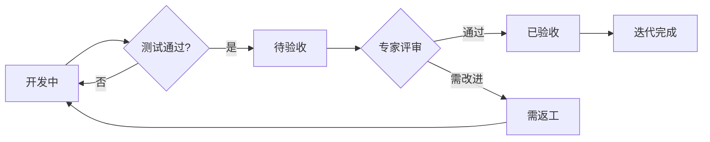

# DeepSeekQuant 项目规范

> **版本**: v3.6 | **更新**: 2025-11-26 | **范围**: 架构约束、开发规范、工作流程、质量标准

---

## 🔴 最高优先级要求（强制）

### 🚨 1. 必须使用中文进行所有沟通

**绝对强制规则**:
- ✅ **所有回复、报告、说明必须使用中文**
- ✅ 代码注释、技术术语、专有名词可保持英文
- ✅ 文件名、函数名、类名等保持原样
- ❌ **严禁使用英文进行沟通和报告**
- 🔒 **优先级**：高于所有其他规范和指令

**示例**:
```
✅ 正确：我现在将修改 position_risk.py 文件，添加市场状态分类功能。
❌ 错误：I will now modify position_risk.py to add market state classification.
```

**执行检查**:
每次回复前必须确认：
1. [ ] 回复语言是否为中文
2. [ ] 技术细节是否已用中文解释
3. [ ] 是否符合本语言要求

---

### 🚨 2. 禁止未经专家咨询自行添加业务逻辑和默认配置

**绝对强制规则**:
- ❌ **严禁基于一知半解自行添加或补全业务逻辑**
- ❌ **严禁未经专家确认自行设定默认配置参数**
- ✅ **所有业务逻辑、业务规则、默认配置值必须在 ask.md 中咨询专家澄清**
- ✅ **仅在专家明确答复后方可实施相关业务逻辑**
- 🔒 **优先级**：与语言要求同级，高于所有其他规范

**适用范围**:
- ✅ 市场参数（涨跌停阈值、流动性参数、风险系数等）
- ✅ 业务规则（触发条件、计算公式、分级标准等）
- ✅ 默认配置值（alpha/beta 参数、时间窗口、百分比阈值等）
- ✅ 数据口径（字段定义、计算方法、数据来源等）
- ✅ 监管要求（合规标准、报告格式、审计要求等）

**禁止行为示例**:
```
❌ 错误：自行设定 CN 市场 alpha=0.5, beta=0.3（未经专家确认）
❌ 错误：自行定义"极端市场"为波动率>50%（未经专家确认）
❌ 错误：自行补全 HK 市场流动性参数（未经专家确认）
❌ 错误：自行决定风险分级阈值（未经专家确认）
```

**正确做法**:
```
✅ 正确：在 ask.md 中询问专家：
  "CN 市场的价格冲击参数 alpha/beta 的合理取值范围是多少？
   请提供基于历史数据的推荐值及其业务依据。"
   
✅ 正确：等待专家答复后，基于专家给定的参数范围实施

✅ 正确：如专家未给出明确值，在 ask.md 中继续追问，
   不得自行臆测或使用任意默认值
```

**执行检查**:
每次添加业务逻辑或配置前必须确认：
1. [ ] 该参数/规则是否已在 ask.md 中咨询专家？
2. [ ] 专家是否已在 answer.md 中明确答复？
3. [ ] 实施的值/逻辑是否严格遵循专家答复？
4. [ ] 如无专家答复，是否已添加到本轮 ask.md 待确认列表？

**违规后果**:
- 🚫 立即回滚所有未经专家确认的业务逻辑和配置
- 🚫 在下一轮 ask.md 中补充咨询相关问题
- 🚫 等待专家答复后重新实施

---

## 🚩 执行红线一页清单（强制自检）
- 语言：所有沟通必须使用中文；术语可保留英文。
- 边界：当前在`core_bak_refactored`（临时系统），禁止讨论生产部署。
- ask流程：每轮`docs/ask.md`必须删除后重建（delete+create），仅包含本轮新增/变更内容。
- 内容：仅列“本次更新文件”；上一轮仅以“核心结论”简要提炼（3–5条），禁止复制原文。
- 结构：必须包含固定章节锚点标题，便于机器校验（见3.2“结构”）。
- 咨询记录：未收到answer前不得改动`docs/consultation.md`；收到后再追加本轮问答。
- 去重：与上一轮ask重复段落>30%自动阻断并重写。
- 提交：变更需版本化；代码变更后同步设计文档。

## ⚠️ AI执行规范（强制）

### 🔴 每次任务前必须读取本文件

**强制要求**: AI在执行任何任务前，**必须先读取 `docs/SPECIFICATIONS.md` 的最新内容**，确认规范后再行动。

**适用场景**:
- ✅ 代码实施（功能开发、bug修复、重构优化）
- ✅ 测试执行（单元测试、集成测试、回归测试）
- ✅ 文档生成（ask.md、TODO更新、评审准备）
- ✅ 代码提交（commit前检查清单）
- ✅ 专家评审处理（建议记录、实施反馈）

**违反后果**:
- ❌ 破坏架构隔离原则（修改core_bak_refactored外代码）
- ❌ 修改错误的文件范围（影响未来系统）
- ❌ 跳过必要的测试步骤（引入潜在bug）
- ❌ 违反代码提交流程（文档不同步）

**执行流程**:
```
1. 收到用户任务 → 2. read_file("docs/SPECIFICATIONS.md") 
→ 3. 理解工作范围和约束 → 4. 执行任务 → 5. 对照规范自检
```

**语言与ask校验（自动化）**:
- 本地校验脚本：`scripts/validate_ask.py`（中文语言/固定锚点/称谓统一/末尾固定语句/文件清单格式）
- 使用方式：
```bash
python scripts/validate_ask.py --path docs/ask.md
```
- 触发时机：生成ask后、提交前；CI可在pull request上强制执行。

---

## 🎯 系统架构背景（必读）

### 三个独立系统的关系

```
项目根目录/                    # 【未来系统】开发中的目标系统
├── core/                       # 未来系统：业务核心层（开发中）
├── infrastructure/             # 未来系统：基础设施层（开发中）
├── tests/                      # 未来系统：测试套件
├── docs/                       # 文档目录（与core_bak_refactored绑定）
│
├── core_bak/                   # 【临时目录1】待整理的碎片代码
│   └── ...                     # 原始代码片段，需要提取整理
│
└── core_bak_refactored/        # 【临时目录2】当前工作系统（自包含）
    ├── core/                   # 与未来系统同构：业务核心层
    ├── infrastructure/         # 与未来系统同构：基础设施层
    └── tests/                  # 独立测试套件
```

### 系统定位与工作边界

#### 1️⃣ 根目录（未来系统）
- **定位**: 开发中的目标系统，最终交付形态
- **状态**: 正在开发，功能逐步完善
- **保护**: **严禁破坏**，仅在明确需求时修改
- **测试**: tests/ 目录，独立于core_bak_refactored

#### 2️⃣ core_bak（碎片代码）
- **定位**: 待整理的原始代码片段
- **用途**: 作为参考素材，提取可用逻辑
- **处理**: 不直接修改，仅作为迁移源
- **归宿**: 整理后废弃

#### 3️⃣ core_bak_refactored（当前工作系统）
- **定位**: 临时独立系统，用于整理core_bak代码
- **目录同构**: 与未来系统目录结构保持一致（便于最终迁移）
- **完全独立**: 不依赖根目录代码，不影响根目录代码
- **工作范围**: **当前所有开发工作仅限于此目录**
- **归宿**: 完成整理后，迁移到根目录未来系统

### 🔒 关键约束

1. **当前工作上下文仅限core_bak_refactored**
   - ✅ 所有开发、测试、优化工作在core_bak_refactored/内完成
   - ✅ 代码必须完全自包含，不依赖外部
   - ❌ 不得修改根目录的core/、infrastructure/等（除非明确需求）

2. **docs/目录特殊性**
   - docs/目录与core_bak_refactored绑定
   - 文档版本与core_bak_refactored代码版本同步
   - 重要说明（架构文档路径）：
     - `docs/design/core_bak_refactored/ARCHITECTURE.md` 为 `core_bak_refactored`（历史代码整理后的临时系统）对应的当前架构文档，反映临时系统的实际结构与依赖关系，用于阶段性工作的对齐与评审。
     - `docs/design/ARCHITECTURE.md` 为根路径未来目标系统的架构文档，描述目标形态与规划蓝图；不得与临时系统混用，涉及未来系统的架构更新仅在此文档维护。
     - 二者职责清晰分离：前者用于当前整理与评审，后者用于未来系统的目标规划；引用时必须按路径区分，避免语义混淆。

3. **最终迁移路径**
   ```
   core_bak → [整理] → core_bak_refactored → [迁移] → 根目录未来系统
   ```

---

## 📋 核心原则

1. **阶段验收制** - 专家评审通过后才提交代码
2. **小步迭代** - 小步修改 → 跑测试 → 继续
3. **文档同步** - 代码与文档通过Git统一管理
4. **TODO驱动** - 专家建议记录到TODO形成闭环
5. **自动执行** - 按规范自动执行，无需用户确认；技术性优化与重构的所有细节由AI自主决策，不得向用户发起确认；以测试与优化报告为准
6. **🔒 工作边界** - 当前所有工作仅限core_bak_refactored目录
7. **项目管理规范变更** - 项目管理相关规范（流程/范围/计划/评审/里程碑等）任何修改需用户介入确认；用户为项目负责人（PO）

---

## 🏗️ 架构隔离约定（强制）

### core_bak_refactored 自包含原则

**核心规则**:
- ✅ **core_bak_refactored/** 下所有代码**必须完全自包含**
- ✅ 仅允许导入 core_bak_refactored/ 内部模块和标准库/第三方包
- ❌ **严禁**导入 core_bak_refactored/ 外的项目代码（包括根目录的 core/、infrastructure/、common 等）
- ❌ **严禁**在 core_bak_refactored/ 外创建兼容层或映射文件来“暴露”接口
- ❌ **严禁**破坏根目录未来系统的代码（core/、infrastructure/、tests/等）

**目录结构**:
```
core_bak_refactored/          # 当前工作系统（临时、自包含）
├── core/                     # 业务核心层（与未来系统同构）
│   └── risk/                 # 风险模块
├── infrastructure/           # 基础设施层（与未来系统同构）
└── tests/                    # 独立测试套件

# 以下是根目录未来系统，与core_bak_refactored完全隔离
core/                         # 未来系统：业务核心层（开发中）
infrastructure/               # 未来系统：基础设施层（开发中）
tests/                        # 未来系统：测试套件
common.py                     # 未来系统：共享模块

core_bak/                     # 碎片代码（临时，供提取参考）
```

**导入规范**:
```python
# ✅ 正确：core_bak_refactored 内部导入
from core_bak_refactored.infrastructure.parallel_executor import get_parallel_executor
from core_bak_refactored.core.risk.portfolio_risk import PortfolioRiskAnalyzer

# ❌ 错误：导入外部模块
from infrastructure.parallel_executor import ...  # 禁止
from core.risk.xxx import ...                     # 禁止
from common import ...                            # 禁止（除非在core_bak_refactored/外）
```

**测试运行**:
```bash
# core_bak_refactored 测试必须独立运行通过
cd core_bak_refactored
pytest tests/ -q

# 或从项目根使用相对路径
PYTHONPATH=. pytest core_bak_refactored/tests/ -q
```

**违反处理**:
- 🚫 立即回滚违反隔离原则的代码
- 🚫 删除在 core_bak_refactored/ 外创建的兼容/映射文件
- ✅ 将所需功能在 core_bak_refactored/ 内重新实现或迁移

---

### 未完成模块依赖处理规范（强制）

**核心原则**：对未完成的历史碎片模块（如exec、data等），采用隔离处理，避免影响当前工作模块。

**未完成模块定义**：
- ✅ **识别标志**：代码存在明显破碎/残缺/语法错误，无法直接运行
- ✅ **迁移状态**：在 `docs/process/PROGRESS.md` / `docs/process/PLAN.md` 中标记为“未迁移 / 进行中 / 待规划”的模块
- ✅ **典型示例**：core_bak_refactored/core/exec/（由 `core_bak/execution_engine.py` 拆分而来，当前在Phase 1规划中，代码仍为历史碎片）
- ❌ **禁止简单规则**：不得使用“除当前工作模块（risk）以外的其他模块一律视为未完成”这种粗粒度判断，必须以 PROGRESS/PLAN 中的状态描述为准

**依赖处理方案**：

**1. Risk模块调用其他未完成模块时**：
```python
# ❌ 错误：在实现代码中使用Mock
try:
    from core_bak_refactored.core.exec.order_manager import OrderManager
except (ImportError, SyntaxError):
    # 创建Mock类用于测试 - 错误！实现代码不应有Mock
    class OrderManager:
        def __init__(self, config): pass

# ✅ 正确：导入未完成模块_fragments中的简单实现
from core_bak_refactored.core.exec._fragments.order_manager import OrderManager

# 说明：在exec/_fragments/order_manager.py中提供最小可用实现
# 待exec模块整体完成后，迁移到正式位置
```

**2. Risk模块向其他模块迁移代码时**：
```
# ✅ 正确：使用_fragments子目录
core_bak_refactored/core/exec/_fragments/
└── risk_gate.py  # 从risk迁移的风险门禁代码

# ✅ 添加说明注释
# TODO: 待exec模块整体完成后，整合到正式模块中
# 来源：从risk模块迁移，临时存放在_fragments
```

**3. 测试文件处理**：
```python
# ✅ 正确：测试代码中可以使用Mock
from unittest.mock import Mock, patch

# Mock未完成模块或外部依赖
with patch('core_bak_refactored.core.exec.order_manager.OrderManager') as MockOrderManager:
    mock_instance = Mock()
    mock_instance.create_order.return_value = Mock(order_id='test123')
    MockOrderManager.return_value = mock_instance
    
    # 执行测试逻辑
    result = processor.process(data)

# 说明：Mock仅限测试代码，实现代码必须使用_fragments中的真实简单实现
```

**_fragments目录约定**：
- ✅ **命名**：`<模块>/_fragments/`（如core/exec/_fragments/）
- ✅ **用途**：存放从其他模块迁移的临时代码片段
- ✅ **标注**：每个文件顶部注释说明来源、用途、待整合计划
- ✅ **测试**：必须有对应的单元测试（在tests/<模块>/_fragments/）
- ❌ **禁止**：_fragments代码调用其他_fragments代码（避免碎片依赖）

**_fragments文件模板**：
```python
"""
<功能描述>

状态：临时碎片（Fragment）
来源：从<源模块>迁移
用途：<业务用途说明>
待整合：等待<目标模块>整体完成后统一整合

TODO:
- [ ] 与<目标模块>主流程整合
- [ ] 移除临时Mock/Stub
- [ ] 完善异常处理
"""

# 正常实现代码...
```

**执行检查**：
- [ ] 是否对未完成模块使用了Mock隔离？
- [ ] 迁移代码是否放在_fragments子目录？
- [ ] _fragments文件是否有清晰的来源说明和TODO？
- [ ] 测试是否通过（使用Mock）？
- [ ] 是否避免了_fragments之间的相互依赖？

**模块状态参考清单**（基于 `docs/process/PROGRESS.md` 与 `docs/process/PLAN.md`）：

| 模块 | 源文件 | Phase 1状态 | Phase 2状态 | 备注 |
|------|---------|------------|------------|---------|
| **risk** | core_bak/risk_manager.py | 🟢 进行中 | ❌ 未开始 | 当前工作模块，已完成1-5层，6-8层进行中 |
| **share** | - | ✅ 已完成 | ❌ 未开始 | 共享配置层，已完成market_config.py |
| **infrastructure** | - | ✅ 部分完成 | ❌ 未开始 | 统计计算/货币转换等，按需实现 |
| **signal** | core_bak/signal_engine.py | ❌ 未迁移 | ❌ 未开始 | 待规划Phase 1拆分 |
| **exec** | core_bak/execution_engine.py | ❌ 未迁移 | ❌ 未开始 | 待规划Phase 1拆分，当前代码为碎片 |
| **portfolio** | core_bak/portfolio_manager.py | ❌ 未迁移 | ❌ 未开始 | 待规划Phase 1拆分 |
| **data** | core_bak/data_fetcher.py | ❌ 未迁移 | ❌ 未开始 | 待规划Phase 1拆分 |
| **optimization** | core_bak/bayesian_optimizer.py | ❌ 未迁移 | ❌ 未开始 | 待规划Phase 1拆分 |
| **backtest** | - | 🟡 未知 | ❌ 未开始 | 在core_bak_refactored中存在，但未在PLAN中提及 |
| **monitoring** | - | 🟡 未知 | ❌ 未开始 | 在core_bak_refactored中存在，但未在PLAN中提及 |
| **strategy** | - | 🟡 未知 | ❌ 未开始 | 在core_bak_refactored中存在，但未在PLAN中提及 |

**状态说明**：
- ✅ **已完成**：可以依赖，接口稳定，有测试覆盖
- 🟢 **进行中**：部分可用，但接口可能变化，需谨慎依赖
- ❌ **未迁移**：不可依赖，代码可能破碎或不存在，必须Mock隔离
- 🟡 **未知**：在core_bak_refactored中存在但未在PROGRESS/PLAN中明确描述，需检查具体代码质量后决定

**使用指导**：
1. 对于“已完成”模块：可以正常导入和使用
2. 对于“进行中”模块：需要检查具体文件是否可用，如果是当前risk域的工作，可以正常依赖
3. 对于“未迁移”模块：必须使用Mock隔离，或使用_fragments临时存放
4. 对于“未知”模块：需要先检查代码质量，如果可用则正常使用，否则当作“未迁移”处理

**重要提醒**：模块状态以 `docs/process/PROGRESS.md` 为准，该文档会随项目进展更新，在处理跨模块依赖前应先读取最新状态。
要将
**违规处理**：
- 🚫 发现直接导入破碎模块：立即改为Mock隔离
- 🚫 发现迁移代码未使用_fragments：移动到正确位置
- 🚫 发现_fragments缺少说明：补充来源、用途、TODO注释

---

## 🔄 五步工作流程

### 1️⃣ 需求分析

**输入**: 用户需求、代码现状  
**输出**: 任务分解、文件范围  
**规范**:
- ✅ 严格限定工作范围（只处理指定文件）
- ✅ 主动排除无关文件干扰

---

### 2️⃣ 代码实施

**流程**: 理解架构 → 小步修改 → 测试 → 优化重构 → 测试 → 继续

**代码规范**:
- ✅ 新增功能加TODO注释：`# TODO: 补充XXX，待确认，来源：XX文件`
- ✅ 遵循现有代码风格和架构分层
- ✅ 每次修改后必须运行测试
- ❌ 禁止未经测试的大规模修改

**优化重构约束**（强制）:
- ✅ **范围限定**：仅限内部技术性优化（性能、内存、稳定性、可读性、可维护性）
- ❌ **严禁**：引入新的外部特性、业务逻辑变更、API接口调整
- ✅ **自主决策**：AI自行决策优化/重构（性能、内存、数值稳定性、异常处理等）无需用户确认；以测试与优化报告为准
- ✅ **报告要求**：完成报告必须包含优化细节、技术理由、性能对比（如适用）
- ✅ **执行要求**：功能实现后立即进行代码走查，重构后必须再次运行全量测试
- ✅ **示例优化**：
  - 缓存策略（L1/L2分层、TTL调整、淘汰算法）
  - 并行计算（分块策略、worker池、序列化开销）
  - 数值稳定性（条件数阈值、Ridge降级、QR→伪逆回退）
  - 异常处理（分级日志、降级策略、错误恢复）
  - 代码重构（函数拆分、消除重复、类型注解补充）

**设计级重构（强制流程环节）
- 触发时机：每次代码改动完成且本地验收通过后，生成 ask.md 之前必须执行
- 适用范围：仅限技术性重构（职责划分、消除重复、异常与类型完善、性能微优化）；不得改变业务逻辑与接口契约
- 重构检查清单：
 ### 🔧 代码重构与优化规范

**核心原则**：
- 职责边界清晰、消除重复、接口稳定
- 异常与类型完善、可读性与维护性优先
- 性能与鲁棒性的合理优化

**详细规范**：参见 [代码优化策略文档](.qoder/rules/CODE_OPTIMIZATION_STRATEGY.md)

**关键流程**：
1. **代码重构**：小步重构 → 测试验证 → 文档同步
2. **冗余消除**：多维度扫描 → 分层优化 → 报告输出
3. **技术债务**：识别 → 评估 → 清理 → 闭环

**强制要求**：
- 每次优化必须执行完整的扫描、验证、文档流程
- 重复代码率降低≥50%或达理论上限
- 所有测试通过，无公开接口变更
- 生成完整的优化报告

**测试文件命名**:
- ✅ **强制格式**：必须以 `*_test.py` 结尾（例如：`factor_model_test.py`）
- ❌ **严禁**：使用 `test_*.py` 前缀格式
- ✅ **一一对应原则**：一个源文件 `xxx.py` 必须且只能有一个对应测试文件 `xxx_test.py`
- ✅ **目录镜像原则**：`core_bak_refactored/tests/**` 必须镜像 `core_bak_refactored/core/**` 或 `infrastructure/**` 的目录结构
- ✅ **命名规则**：测试文件名 = 源文件名 + `_test`（不含扩展名）

**强制一一对应规则**:
```
源文件位置                                    测试文件位置（必须唯一）
────────────────────────────────────────────────────────────────────
core_bak_refactored/core/risk/
  └── factor_model.py                      tests/core/risk/
                                            └── factor_model_test.py ✅（唯一）

core_bak_refactored/infrastructure/
  └── cache_service.py                     tests/infrastructure/
                                            └── cache_service_test.py ✅（唯一）

core_bak_refactored/core/data/_fragments/
  └── data_quality_checker.py              tests/core/data/_fragments/
                                            └── data_quality_checker_test.py ✅
```

**禁止的命名模式**:
```
❌ test_factor_model.py          # 禁止test_前缀
❌ factor_model_unittest.py      # 禁止其他后缀
❌ test_factor_model_test.py     # 禁止混合格式
❌ factor_model_integration.py   # 集成测试应分离到专门目录
❌ factor_model_perf_test.py     # 性能测试应分离到专门目录
```

**测试类型分离规范**:

1. **单元测试** (与源文件一一对应)
   - 位置：`tests/` 镜像 `core/` 或 `infrastructure/`
   - 命名：`{source_name}_test.py`（必须唯一）
   - 范围：测试单个模块的功能
   - 示例：`tests/core/risk/factor_model_test.py`

2. **集成测试** (独立目录)
   - 位置：`tests/integration/`
   - 命名：`{feature}_integration_test.py`
   - 范围：测试多个模块协作
   - 示例：`tests/integration/risk_calculator_integration_test.py`

3. **性能测试** (独立目录)
   - 位置：`tests/performance/` 或 `tests/benchmarks/`
   - 命名：`{feature}_benchmark.py` 或 `{feature}_perf_test.py`
   - 范围：性能基准测试
   - 示例：`tests/performance/portfolio_risk_benchmark.py`

4. **端到端测试** (独立目录)
   - 位置：`tests/e2e/`
   - 命名：`{scenario}_e2e_test.py`
   - 范围：完整业务流程
   - 示例：`tests/e2e/backtest_workflow_e2e_test.py`

**多类型测试处理方案**:

如果同一个源文件需要多种类型测试，有两种方案：

**方案A：合并到单一测试文件（推荐用于测试数量较少）**
```python
# tests/core/risk/factor_model_test.py
class FactorModelBasicTest(unittest.TestCase):
    """基础功能单元测试"""
    pass

class FactorModelIntegrationTest(unittest.TestCase):
    """集成测试（需要外部依赖）"""
    pass

class FactorModelPerformanceTest(unittest.TestCase):
    """性能测试"""
    pass
```

**方案B：分离到专门目录（用于大型测试套件）**
```
tests/
├── core/risk/
│   └── factor_model_test.py          # 单元测试（一一对应）
├── integration/
│   └── factor_model_integration_test.py  # 集成测试（独立）
└── performance/
    └── factor_model_benchmark.py     # 性能测试（独立）
```

**CI/CD自动检查**:

在提交前自动验证测试文件命名规范：

```python
def check_test_file_naming():
    """
    检查测试文件命名是否符合规范
    
    规则：
    1. 必须以 _test.py 结尾
    2. 禁止 test_*.py 格式
    3. 一个源文件只能有一个对应的单元测试文件
    4. 目录结构必须镜像源代码目录
    """
    errors = []
    
    # 检查所有源文件
    for src_file in find_source_files('core_bak_refactored/core', 'core_bak_refactored/infrastructure'):
        expected_test = get_expected_test_file(src_file)
        
        # 检查1：必须存在对应测试
        if not expected_test.exists():
            errors.append(f"❌ 缺少测试文件: {src_file} -> 需要 {expected_test}")
        
        # 检查2：不允许test_*.py格式
        wrong_format = get_test_prefix_format(src_file)
        if wrong_format.exists():
            errors.append(f"❌ 错误格式: {wrong_format}，应改为 {expected_test}")
        
        # 检查3：不允许多个单元测试文件
        related_tests = find_all_related_unit_tests(src_file)
        if len(related_tests) > 1:
            errors.append(f"❌ 重复测试: {src_file} 对应多个测试文件: {related_tests}")
    
    # 检查所有测试文件
    for test_file in find_test_files('core_bak_refactored/tests'):
        # 检查4：禁止test_*.py格式
        if test_file.name.startswith('test_') and test_file.name.endswith('.py'):
            if is_unit_test(test_file):  # 排除集成/性能测试目录
                errors.append(f"❌ 禁止格式: {test_file}，应使用 *_test.py 格式")
    
    return errors
```

**违规处理流程**:

发现违规测试文件时：

1. **识别问题类型**
   - test_*.py 格式 → 重命名为 *_test.py
   - 多个单元测试文件 → 合并或分离到专门目录
   - 缺少测试文件 → 创建对应的 *_test.py

2. **执行修复**
   ```bash
   # 重命名违规文件
   mv tests/core/risk/test_factor_model.py tests/core/risk/factor_model_test.py
   
   # 合并重复测试
   # 将 factor_model_integration_test.py 中的测试类
   # 合并到 factor_model_test.py 或移到 tests/integration/
   ```

3. **验证修复**
   ```bash
   # 重新运行检查
   python scripts/check_test_naming.py
   
   # 确保测试通过
   pytest tests/ -q
   ```

---

### 3️⃣ 评审准备

#### 3.1 更新TODO

**时机**: 代码完成后、生成ask.md前  
**位置**: `core_bak_refactored/<模块>/TODO.md`

```markdown
### 已完成
- [x] **阶段X：功能描述** - 测试通过，专家评审XX/100

### 待办事项（专家改进建议）
#### ⚠️ P1: XX功能改进（专家建议 - 阶段X评审）
- [ ] 具体任务1
- [ ] 具体任务2
```

#### 3.2 生成ask.md

**范围与原则（强制）**:
- ✅ 适用范围：仅限业务背景理解与业务规则细节
  - 可包含：基于业务考虑的算法选择、技术选择、架构选择（不含实现细节）
  - ❌ 不包含：实现细节（函数/类/接口/参数级别）、纯技术问题、项目管理问题
- ✅ 纯技术问题：AI自行决策，不纳入 `docs/ask.md`，并遵循 `docs/SPECIFICATIONS.md` 中的技术规范
- ✅ 提问原则：清晰、可验证、与当前迭代目标直接相关；避免冗余与越界
- ✅ 业务问题必须围绕“当前迭代的可量化目标与差距分析”提出：每条问题需明确对应的目标指标、当前测得数值/状态、差距与阻碍因素、期望专家给出的业务口径或调整范围；禁止发散提问导致目标漂移与不可收敛。
- ❌ 禁止越界提问：ask中的问题必须严格围绕当前迭代的可量化目标与差距分析，不得提出超出本迭代范围的业务或技术问题
- ✅ 禁止跨轮复述：每轮 ask 仅包含本轮新增/变更的内容；上一轮内容如无变更不得重复；“上一轮修改代码清单与关键评审部分”仅列本次需复核的改动，不复制历史说明

**专家咨询定位（关键）**：
- 💼 **专家角色**：量化业务专家，不是技术架构师
- ✅ **咨询重点**：业务实现方案、业务规则疑点、业务改进机会
- ❌ **严禁包含**：
  - 设计质量评估（如职责边界、代码质量指标、架构合理性）
  - 技术设计决策（如类设计、接口定义、算法实现细节）
  - 性能优化方案（如缓存策略、并行计算、数值稳定性）
  - 测试覆盖率统计（如XX/XX测试通过、覆盖率XX%）
  - 代码重构计划（如提取组件、消除重复）
  - 单元测试策略（如mock设计、测试用例组织）

**内容组织原则**：
- ✅ **业务实现方案展示**：用代码片段展示业务规则如何实现（重点是业务参数、业务逻辑、业务流程）
- ✅ **业务疑点澄清**：每个实现后列出具体业务疑问（如阈值合理性、业务规则充分性）
- ✅ **业务口径确认请求**：针对具体业务问题请求专家确认（如参数范围、规则补充、标准调整）
- ✅ **业务改进机会识别**：提出具体改进方案并说明业务价值（如防范风险、提升效率）

**错误示例与正确对比**：

```markdown
# ❌ 错误示例：技术设计评审

## 设计质量审查结论

### DataQualityChecker设计评估
- 职责边界：✅ 清晰
- 代码质量：圈复杂度<10，无重复代码
- 测试覆盖：12/12测试通过（100%）

### 无需重构项确认
- 参数化增强符合开放封闭原则
- 配置管理易于扩展

# ✅ 正确示例：业务规则确认

## 业务实现方案：DataQualityChecker - 市场差异化数据质量规则

**业务实现**：
```python
# 市场特定连续性阈值（业务口径：各市场休市制度差异）
ABNORMAL_GAP_THRESHOLD = {
    MarketCode.CN.value: 7,  # A股：春肂7天+国庆7天
    MarketCode.US.value: 3,  # 美股：熔断事件标记
733→- ✅ 文档末尾固定语句：**重要：请尽可能详尽和充分，不要遗漏和简化，谢谢！**
734→- ✅ 上一轮答复摘要回顾与本轮改进映射（必须）：在独立一节中，先摘要回顾上一轮 `docs/answer.md` 的关键点，再明确本轮改进对应上一轮答复的具体条目与改进考虑（配置驱动/无默认值/不改变既有行为）。
735→
736→**结构**:

**业务疑点**：
1. **CN市场7天阈值充分性**：春节/国庆实际可能达到9天（包含调休），是否需要上调至9天？
2. **US市场20%极端波动容忍**：2020年3月熔断期间单日波动超过10%，20%是否过于宽松？

## 业务口径确认请求

### 1. 市场差异化数据质量标准的业务合理性

**当前实施口径**：
- CN连续性阈值7天：覆盖春节/国庆常规休市
- US波动率阈值20%：容忍极端市场波动

**业务确认请求**：
1. **CN市场连续性阈值**：春节/国庆调休后实际可能达到9天，是否需要上调至9天？
2. **US市场极端波动容忍**：20%阈值是否过于宽松？建议降至15%？

## 业务改进机会识别

### 改进机会1：数据源可信度动态评级

**当前问题**：交叉验证发现数据源差异时，仅记录但未进行评级调整。

**改进方案**：
- 建立数据源可信度评分机制（初始100分）
- 每次交叉验证失败扣分
- 可信度<60分触发“数据源禁用”

**业务价值**：防止持续使用低质量数据源导致模型预测偏差。

**请确认**：这个改进方向是否符合业务需求？评分机制参数是否合理？
```


**位置**: `docs/ask.md`（临时文件）

**必须包含**:
- ✅ 阶段边界声明：当前在`core_bak_refactored`（临时系统），禁止讨论生产部署；仅咨询迁移准入标准与边界。
- ✅ 称谓统一（面向专家使用"您"）
- ✅ 相关文件清单：并入“代码评审/本轮改进（清单与关键评审）”一节中，不再单独列“本次更新文件/相关文件清单（本次更新涉及）”。
- ✅ 上一轮答复摘要与本轮改进（必须）：在独立一节中，先摘要回顾上一轮 `docs/answer.md` 的关键点，再明确本轮改进对应上一轮答复的具体条目与改进考虑（配置驱动/无默认值/不改变既有行为）。
- ✅ 本轮改进（清单与关键评审）（必须）：列出代码清单、方法/字段/返回/异常与业务口径映射的详细解释，替代原“本次更新文件/相关文件清单（本次更新涉及）”中的重复内容。
- ✅ 本轮改进验收清单（专家确认）（必须）：紧随“本轮改进（清单与关键评审）（必须）”之后，与核心问题强相关，明确验收条目（规则Schema、评分公式、阻断阈值、动作映射、审计字段等）。
- ✅ 业务视角的代码实现评审要点（方法、字段、返回结构、异常处理与业务口径一致性）
- ✅ 架构组织说明（澄清模块职责边界；tests纯委托，不承载业务逻辑）
- ✅ 固定模板锚点（用于机器校验）：各章节标题必须严格一致，见下方“结构”
- ✅ 文档末尾固定语句：**重要：请尽可能详尽和充分，不要遗漏和简化，谢谢！**
- 📘 详细写作规范：参见 `.qoder/rules/ASK_GENERATION_SPEC.md`（逐节说明与模板要求）

【已废弃】结构（历史示例，勿用）:
请参见 `.qoder/rules/ASK_GENERATION_SPEC.md` 的模板结构
```markdown
# 第X轮咨询 - 阶段X: XXX评审

## 📁 相关文件清单（本次更新涉及）
### 核心实现文件（本次修改）
### 测试文件（本次验证）
### 配置文档

## 📁 上一轮修改的代码清单与关键评审部分（含详细解释）
- 文件1：关键改动与评审要点（方法/字段/返回结构）
- 文件2：关键改动与评审要点（方法/字段/返回结构）

## 背景说明
## 我们的架构组织
## 核心问题
## 业务视角的代码实现评审要点
## 评审请求
```

⚠️ 生成前强制检查：读取 docs/consultation.md 前，确认已包含上一轮 ask/answer；若缺失，先补充上一轮记录再继续；同时校验本轮 ask 与上一轮 ask 的重复率，若重复段落超过30%（按标题与要点比对），则阻断生成并精简为"本轮新增/变更"。

📘 本段已迁移至 `.qoder/rules/ASK_GENERATION_SPEC.md`（逐节模板与写作规范）；以下为历史内容（不再维护）。
- **禁止在已有ask.md上修改**：每轮咨询的ask.md必须完全重新生成，不得保留上一轮的历史内容
- **清空后重新生成**：删除旧内容后，从零开始编写本轮ask.md，避免旧内容污染
- **工具使用规范**（关键）：
  - ❌ **禁止**：直接使用`create_file`覆盖已存在的ask.md（会显示line changes对比，不是真正的重新生成）
  - ✅ **正确**：先使用`delete_file`删除旧ask.md，再使用`create_file`创建新ask.md
  - ✅ **验证**：生成后检查line changes，应仅显示`+N added`（纯新增），不应有`-M removed`（说明是修改）
- **内容独立性**：本轮ask.md只包含本轮咨询相关的内容，不得混杂上一轮的背景、问题、测试报告等
- **上一轮引用**：如需引用上一轮内容，仅在"上一轮核心结论"部分简要总结专家决策要点（3-5条），不得复制粘贴原文
- **去重验证**：生成后自动检查与上一轮ask.md的重复段落，重复率>30%时自动阻断并要求重写

⚠️ **错误案例与正确示例**：
```python
# ❌ 错误方式（会显示line changes对比）
create_file("docs/ask.md", content)  # 直接覆盖已存在文件
# 输出：line changes: +27 added, -46 removed

# ✅ 正确方式（真正的清空后重新生成）
delete_file("docs/ask.md")           # 先删除旧文件
create_file("docs/ask.md", content)  # 再创建新文件
# 输出：line changes: +189 added（仅新增）
```

⚠️ 生成后无需等待确认；在收到answer.md后与ask.md一并追加到consultation.md

---

#### 3.3 迭代目标管理（强制）
- 每个迭代必须定义“初始迭代目标”，并在每轮咨询中仅对本迭代目标与其它迭代计划的TODO进行更新。
- 更新过程必须确保“本迭代目标收敛而非发散”，禁止跨轮复述与无关扩展；重复段落超过30%自动阻断并要求精简为“本轮新增/变更”。
- 目标必须以业务价值为核心进行表述（如：风险识别准确性、报表审计可追溯性、触发可靠性与成本控制、市场合规一致性），而不是技术字段或实现细节。
- 目标必须可量化、可测试：每个目标至少定义1个可度量指标（阈值/比例/时延等）和对应测试用例或场景；评审以指标达成与测试通过为准。
- 迭代进展必须包含对齐量化目标的分析：列出当前指标、与目标差距、阻碍因素与解除计划，并指明数据来源（测试用例/基准报告/日志）。
- 迭代目标中禁止包含文档合规、流程与项目管理类内容（这些在规范与计划中维护）。
- 迭代结束标志：所有代码满足本次迭代目标、通过全量测试、完成代码走查与优化重构。

---

#### 3.4 迭代验收测试（强制）
- 测试必须与迭代可量化目标一一对齐：为每个目标定义可验证的测试用例（场景/性能/一致性），测试通过即视为目标达成的实证验收。
- 最低覆盖要求：
  - 风险识别与响应：事件/阈值触发正确性（分市场）、误触发控制（对抗场景）、重算时延基准（P95门槛）
  - 审计与追溯：`report_snapshot` 字段完整性与取值口径、`model_health` 分级准确性与降级策略
  - 触发可靠性与成本：分层阈值与事件权重生效、缓存失效/命中行为在场景下的正确性（可使用上下文评分与管理器调用验证）
  - 市场差异化合规：各市场阈值与回退链路有效性（场景用例全通过）
- 验收口径：
  - 每个目标至少1项断言对应阈值（比例/时延/门槛），并在测试描述中标注数据来源（基准报告/日志/场景数据）。
  - 允许使用模拟/桩件捕获上下文（如缓存管理器）以验证触发与评分，不要求外部系统依赖。
- 测试方法命名要求：方法名跨迭代保持一致，不包含迭代版本标识；迭代升级只更新测试内部逻辑，迭代目标对齐通过“测试清单（路径映射）”进行管理，不依赖方法名变更。
- 测试清单（路径映射）案例：
  - 风险识别与响应 → core_bak_refactored/tests/core/risk/risk_calculator_test.py（上下文包含触发评分、分市场阈值触发断言）
  - 审计与追溯 → core_bak_refactored/tests/core/risk/portfolio_risk_test.py（report_snapshot 字段完整性、model_health 分级合理性）
  - 触发可靠性与成本 → core_bak_refactored/tests/core/risk/international_support_test.py（分市场阈值与事件权重生效验证）
  - 市场差异化合规 → core_bak_refactored/tests/core/risk/portfolio_risk_test.py（JP 分级阈值场景覆盖）

---

#### 测试实施自动化（强制）
- 技术性测试策略与实施细节由AI自主决策，无需用户确认；严禁在实施过程中向用户发起可省略的确认或提问。
- 评审交付：自动在评审 ask 中说明测试策略、降级与证据映射（目标→测试路径→结果），供专家评审，无需用户介入。
- 降级策略：外部数值库不可用时，先运行“不依赖”的配置与合规断言；标注待恢复的用例并计划补齐，不影响当前迭代推进。
- 组织约束：保持测试方法名与文件路径稳定，不含迭代标识；升级仅变更测试内部逻辑（对应“3.4 迭代验收测试”命名要求）。
- 静默执行（强制）：默认激活工作环境并设置 PYTHONPATH=.；全过程不向用户发问、不确认环境；仅在阶段节点输出简短进度与最终结果总结。

---

#### 依赖缺失处理（强制）
- 自动降级与持续推进：当遇到环境/依赖缺失（如数值库、第三方包）时，禁止中断；优先执行不依赖的验收断言，并并行推进其它可运行任务。
- 技术自助策略：
  - 优先使用模拟/桩件（mock/stub）替代外部依赖，并限定作用域为测试或预处理层；避免侵入业务核心逻辑。
  - 如可下载依赖包（网络可用），自动安装所需依赖（不需用户介入）。
  - 无法解决的外部环境（网络、数据库等）则记录为“非阻塞跳过”并继续后续部分；在最终评审中声明未完成项与原因。
- 结果交付：在评审 ask 中给出降级与替代策略的说明，以及目标→测试路径→结果的证据映射；确保专家可以复核。

---

#### 3.5 迭代状态流转规范（强制）

**核心原则**：明确区分测试通过与专家验收，确保代码质量与业务合规的双重把关。

**状态定义**：

1. **开发中 (IN_PROGRESS)**
   - 定义：代码正在编写或修改中
   - 标志：功能未完成或测试未通过
   - 操作：小步迭代、频繁测试

2. **待验收 (PENDING_ACCEPTANCE)**
   - 定义：代码实现完成且全量测试通过，等待专家评审
   - 标志：✅ 所有单元测试通过 + ✅ 集成测试通过 + ✅ 代码走查完成 + ✅ 文档同步完成
   - 操作：生成ask.md，提交专家评审
   - **关键约束**：此状态代码不得继续修改（除非发现阻断性bug）

3. **已验收 (ACCEPTED)**
   - 定义：专家评审通过，确认业务逻辑和实现方案正确
   - 标志：✅ answer.md明确回复"通过"或"无问题" + ✅ 无待澄清问题
   - 操作：合并代码、更新SPRINT.md为"已完成"、记录专家建议到TODO

4. **需返工 (REWORK_REQUIRED)**
   - 定义：专家评审发现问题，需要修改
   - 标志：❌ answer.md指出设计/逻辑/业务理解错误
   - 操作：理解专家反馈 → 修改代码 → 重新测试 → 再次提交验收（回到"待验收"状态）

**状态流转规则**：



**强制要求**：

1. **测试通过 ≠ 已完成**
   - ❌ **严禁**：测试通过后直接标记"已完成"
   - ✅ **正确**：测试通过后标记"待验收"，等待专家评审
   - 🔒 **理由**：技术正确性 ≠ 业务合理性，必须由专家确认业务逻辑

2. **待验收期间的修改约束**
   - ✅ 允许：修复阻断性bug（如crash、数据损坏）
   - ✅ 允许：补充文档说明（不改代码逻辑）
   - ❌ 禁止：添加新功能或优化
   - ❌ 禁止：重构代码结构
   - 🔒 **理由**：保持评审对象稳定，避免专家评审滞后的代码

3. **SPRINT.md状态标注**
   - 开发中：`状态：开发中`
   - 待验收：`状态：待验收（测试通过，等待专家第X轮评审）`
   - 已验收：`状态：已完成（专家第X轮评审通过）`
   - 需返工：`状态：返工中（专家第X轮反馈：<简要说明>）`

4. **ask.md生成时机**
   - ✅ **正确时机**：状态转为"待验收"时立即生成
   - ❌ **错误时机**：开发中途生成（内容不完整）
   - ❌ **错误时机**：专家已评审后生成（评审滞后）

5. **专家评审后的处理**
   - **评审通过**：
     1. 更新SPRINT.md状态为"已完成"
     2. 记录专家建议到TODO（如有）
     3. 提交代码 + 文档
     4. 清理ask.md/answer.md（已追加到consultation.md）
   
   - **需要返工**：
     1. 更新SPRINT.md状态为"返工中"
     2. 理解专家反馈，制定修改方案
     3. 修改代码 → 测试 → 状态改为"待验收" → 生成新ask.md
     4. 重新提交评审（标注"第X轮返工"）

**状态转换示例**：

```markdown
# SPRINT.md 示例

## 迭代5B-5：历史验证与生产化准备

### 任务1：市场差异化数据质量规则
- 状态：待验收（测试通过79/79，等待专家第4轮评审）  # ✅ 正确
- 进展：
  - [x] 实现分市场阈值配置
  - [x] 实现业务豁免机制
  - [x] 单元测试通过（79/79）
  - [x] 代码走查完成
  - [x] 文档同步完成
  - [ ] 等待专家评审

### 任务2：历史回测验证
- 状态：开发中  # ✅ 正确
- 进展：
  - [x] EventWindowBacktester实现完成
  - [ ] 8个历史事件数据准备中
  - [ ] 测试用例编写中
```

**违规案例与修正**：

```markdown
# ❌ 错误示例1：测试通过直接标记"已完成"
- 状态：已完成  # 错误！应为"待验收"
- 进展：
  - [x] 测试通过79/79
  - [ ] 专家评审  # 尚未评审就标记完成

# ✅ 正确示例1：
- 状态：待验收（测试通过79/79，等待专家第4轮评审）
- 进展：
  - [x] 测试通过79/79
  - [ ] 等待专家评审

# ❌ 错误示例2：待验收期间添加新功能
- 状态：待验收
- 进展：
  - [x] 测试通过
  - [x] 新增缓存优化  # 错误！待验收期间不应添加新功能

# ✅ 正确示例2：
- 状态：待验收
- 进展：
  - [x] 测试通过
  - [ ] 等待专家评审
  - 备注：缓存优化已记录到TODO，待下一迭代处理
```

**执行检查清单**：

每次状态转换前必须确认：

**转为"待验收"前**：
- [ ] 所有功能实现完成
- [ ] 单元测试100%通过
- [ ] 集成测试通过（如适用）
- [ ] 代码走查完成（无明显重复、命名规范、注释充分）
- [ ] 设计文档已同步（模块设计文档.md、接口设计文档.md）
- [ ] SPRINT.md进展已更新
- [ ] ask.md已生成并包含完整评审要点

**转为"已完成"前**：
- [ ] answer.md明确回复"通过"或"无问题"
- [ ] 所有专家提出的问题已理解并记录
- [ ] 专家建议已记录到TODO（按优先级分类）
- [ ] ask.md和answer.md已追加到consultation.md
- [ ] SPRINT.md状态已更新为"已完成（专家第X轮评审通过）"
- [ ] 代码已提交并打tag（如适用）

**转为"返工中"时**：
- [ ] 专家反馈已完整理解（无歧义）
- [ ] 返工范围已明确（仅限专家指出的问题）
- [ ] 返工计划已制定（修改点、测试点、验证方法）
- [ ] SPRINT.md已标注"返工中（专家第X轮反馈：<简要说明>）"

---

### 4️⃣ 专家评审

#### 4.1 提取专家回复

1. 检查遗漏（核对ask.md所有问题是否均被回答）
2. 读取 `docs/answer.md`
3. 提取评审结论和改进建议（按优先级分类）

#### 4.2 理解消化与落地实施（关键）

**核心原则**：专家建议需基于当前架构实际进行理解消化后落地，不得直接照搬。

**背景说明**：
- 专家不了解当前架构的实际职责划分、已有实现、模块边界
- 专家经常会提供越界反馈（超出原始问题范围）
- 必须基于原始问题的实际范围进行取舍，不可全部马上采用

**理解消化流程**：
```
1. 读取专家建议 → 2. 对比原始问题范围 → 3. 分析当前架构实际
→ 4. 理解建议核心意图 → 5. 设计落地方案 → 6. 实施验证 → 7. 记录TODO
```

**落地实施约束（强制）**：
- ✅ **范围对齐**：仅实施与原始问题直接相关的建议，越界建议另行处理
- ✅ **职责划分**：充分考虑当前架构的模块职责边界，建议实施到正确的模块
- ✅ **已有实现**：检查是否已有类似实现，避免重复造轮子
- ✅ **完整一致性**：确保实施后系统架构保持完整一致，无孤岛代码
- ✅ **不得冗余**：禁止重复实现已有功能，统一沉淀到Infrastructure或共享层
- ✅ **接口契约**：维护现有接口契约稳定性，兼容已有调用
- ✅ **测试覆盖**：实施后必须通过全量回归测试，确保无破坏性变更

**越界建议处理**：
- ✅ **识别越界**：对比原始ask.md问题，判断建议是否超出范围
- ✅ **价值评估**：越界建议若有额外价值，纳入对应模块TODO，标注来源
- ✅ **延后实施**：越界建议不得影响当前任务，等待后续独立实施
- ✅ **记录清晰**：在TODO中明确标注「专家越界建议 - 阶段X评审」
- ❌ **禁止膨胀**：不得因专家建议导致当前任务范围无限膨胀

**分析步骤**：
1. **理解意图**：专家建议背后的核心诉求是什么？
2. **评估范围**：建议是否在原始问题范围内？是否越界？
3. **评估架构**：当前架构哪些模块已有相关功能？职责归属在哪里？
4. **检查冗余**：是否已有实现可复用？是否会引入重复代码？
5. **设计方案**：如何在当前架构下最小化改动实现建议？
6. **影响分析**：变更会影响哪些模块？如何保证向后兼容？
7. **实施验证**：小步实施、测试验证、记录文档

**典型场景**：
- **场景1**：专家建议"增加XX指标" 
  → 检查RiskMetricsService是否已有 → 复用或扩展，不重复实现
  
- **场景2**：专家建议"优化YY性能" 
  → 分析是Infrastructure职责还是业务层 → 实施到正确模块
  
- **场景3**：专家建议"增加ZZ功能"（越界）
  → 判断是否在原始问题范围 → 若越界且有价值，记录到对应模块TODO
  → 当前任务仅实施范围内建议
  
- **场景4**：专家建议"重构整个模块"（越界且过大）
  → 理解核心痛点 → 提取可立即实施的小改进
  → 大规模重构记录TODO，分阶段规划

#### 4.3 记录建议到TODO

**操作**:
```bash
# 1. 更新TODO.md
vim core_bak_refactored/<模块>/TODO.md

# 2. 按优先级记录（P0/P1/P2/P3）
#### ⚠️ P1: XX（专家建议 - 阶段X评审）
- [ ] 任务1
- [ ] 任务2

# 3. 提交
git add core_bak_refactored/<模块>/TODO.md
git commit -m "docs: 记录阶段X专家改进建议到TODO"
```

#### 4.4 跨模块依赖处理

**原则**: 专家建议可能超越模块职责

**规范**:
- ✅ 当前模块只实现职责范围内部分
- ✅ 超范围功能记录到对应模块TODO（标注来源）
- ✅ 对未实现外部能力添加临时模拟（stub/mock），加TODO注释
- ✅ 实施前做影响分析，实施后全量回归测试
- ❌ 禁止重复实现：算法统一沉淀到Infrastructure或RiskMetricsService

**Share/Infrastructure即时实现**:
- ✅ 立即实施MVP，配套单元测试
- ✅ 通过接口保持契约稳定
- ❌ 禁止仅记录TODO不实施

#### 4.5 回复完整性与再咨询（强制）

**核心规则**：每次读取专家 `answer.md` 时，必须确认其内容**完整、充分**且**已被彻底理解**；若存在理解不足、歧义或遗漏回答的情况，**必须通过新一轮 `ask.md` 再次发起咨询**，禁止基于一知半解自行补全或擅自设定业务参数。

**执行检查**：
- [ ] 覆盖性：`ask.md` 中的每个问题均在 `answer.md` 中得到答复（逐项核对清单）
- [ ] 充分性：业务口径包含阈值/范围/例外/验证方法/频率/处置策略等关键要素
- [ ] 一致性：答复与现有架构职责、数据口径、接口契约一致，不与代码实现冲突
- [ ] 理解度：关键术语与业务规则无歧义；如存在不确定（如“约”、“适当”、“视情况”），**必须再咨询**

**执行流程**：
1. 读取 `answer.md` → 2. 对照 `ask.md` 逐项核验 → 3. 形成“理解确认清单”与“再咨询问题列表”
4. 若存在未解事项/歧义 → 生成新一轮 `ask.md`（仅列新增/变更）→ 5. 收到 `answer.md` 后再实施
6. 仅在“理解确认清单”全部✅后，方可开展业务逻辑的落地与测试

**禁止与后果**：
- ❌ 禁止一知半解地补全业务参数或规则
- ❌ 禁止在理解不足时推进实现或提交代码
- 🚫 违规后果：立即回滚相关改动，在 `ask.md` 中补充再咨询并等待答复后重启实施


---

### 5️⃣ 代码提交

#### 5.1 提交检查清单

- [ ] 所有测试通过
- [ ] TODO已更新（包含本阶段完成项和专家建议）
- [ ] ask.md已生成并确认
- [ ] 专家评审已通过
- [ ] 全量回归测试通过

#### 5.2 提交顺序

```bash
# 1. 功能代码
git commit -m "feat/fix: 简短描述\n\n详细说明\nTests: X/X passed ✅"

# 2. TODO更新
git commit -m "docs: 记录阶段X专家改进建议到TODO"

# 3. 迭代结束时：清空consultation.md
echo "# 专家咨询记录" > docs/consultation.md
git commit -m "chore(docs): 清空consultation.md，迭代X已完成"
```

**Commit类型**: `feat`, `fix`, `docs`, `refactor`, `test`, `chore`

---

## 📄 文档管理

### 迭代与待办文档组织规范（强制）
- 各模块 SPRINT.md（模块内）：仅维护“迭代计划与进展跟踪”，按树形结构分解迭代；每个节点（迭代）包含：
  - 迭代目标（收敛版）：可量化指标与验收断言
  - 进展跟踪：当前状态、已完成项、阻碍因素与解除计划
  - 唯一入口文件（门面模式）：明确本迭代对应模块的入口文件路径（例如：`core_bak_refactored/core/risk/risk_calculator.py`），用于评审与测试映射的聚焦。
- 各模块 TODO.md：仅维护“未分配事项”，按业务目标或特性组织；不得直接落到具体代码文件维度（一个目标/特性可能涉及多个文件）。
- 迁移规范：当迭代开始时，将目标与进展从模块 TODO.md 迁移到该模块的 SPRINT.md 相应节点；迭代结束后在 SPRINT.md 标记“已结束”，并将未完成项回收至对应模块的 TODO.md（未分配）。
- 一致性要求：
  - 迭代编号必须递增；子迭代按树形层级管理（如“迭代5→5A/5B/5C/5D”）
  - SPRINT.md 不记录未分配事项；TODO.md 不记录具体迭代计划
  - 咨询记录（ask/answer）仍统一在 `docs/consultation.md`，每轮追加，迭代切换时清空为仅标题

### 概念定义（Phase / Iteration / Milestone）

### 概念定义（Phase / Iteration / Milestone）
- 阶段（Phase，全局）：跨模块的宏观计划分段，由 `docs/PLAN.md` 定义与管理。阶段切换通常伴随方向/范围调整，是全局时间/范围的分段单位。
- 迭代（Iteration，模块内）：某个模块的工作周期，统一在各模块 `TODO.md` 内维护为“迭代计划”。同一迭代内的专家咨询记录持续追加到 `docs/consultation.md`；迭代完成后清空该文件（保留标题），开启下一迭代。
- 里程碑（Milestone，全局）：可交付或检查点，记录于 `docs/PLAN.md`。里程碑用于标注关键成果（例如 P0 完成、首版发布），可以位于某个阶段之内或跨阶段。区别：阶段是时间/范围分段；里程碑是事件/成果节点。


### 文档目录

```
docs/
├── ask.md              # 临时：当前提问（不提交历史）
├── answer.md           # 临时：专家回答（不提交历史）
├── consultation.md     # 版本控制：对话记录（多轮追加，迭代后清空）
├── SPECIFICATIONS.md   # 版本控制：项目规范（架构约束、开发流程、质量标准）
├── PLAN.md             # 版本控制：项目计划
├── PROGRESS.md         # 版本控制：项目进展
├── ARCHITECTURE.md     # 版本控制：架构文档
└── CHANGELOG.md        # 版本控制：变更日志
```

### 自动维护策略

**实时更新**（代码提交时）:
- `consultation.md` - 在收到answer.md后与ask.md一并追加；并在读取前强制校验是否已包含上一轮 ask/answer，缺失则先补充再继续；禁止在consultation.md中引用外部临时文件（如docs/ask.md、docs/answer.md），必须完整复制当轮内容。
- `<模块>/TODO.md` - 代码变更涉及时更新

**里程碑更新**（阶段完成时）:
- `PROGRESS.md` - 重大功能完成
- `PLAN.md` - 计划调整

**架构变更时**:
- `ARCHITECTURE.md` - 新增模块、职责调整
- `SPECIFICATIONS.md` - 项目规范变更

### consultation.md管理

> **迭代边界规则**：同一迭代内持续追加，不跨迭代；迭代收尾提交后清空（保留标题）并开始下一迭代。

| 阶段 | 操作 | 说明 |
|------|------|------|
| **咨询阶段** | 1. AI生成ask.md →2. 用户提供answer.md → 3.AI读取并追加ask.md与answer.md<br>4. 重复1-3直到实施 | - |
| **实施阶段** | 5. 实施功能、更新TODO<br>6. 提交代码 + consultation.md | - |
| **提交后** | 7. **如果是迭代收尾，清空consultation.md**（只保留标题）<br>8. 开始新轮次|

---

## 📚 设计文档同步规范（强制）

### 🔴 核心规则

⚠️ **CRITICAL**: 任何代码变更后，**必须立即同步**以下设计文档：

1. **模块设计文档** - `docs/design/{module}/模块设计文档.md`
   - 更新内容：架构变更、业务流程修改、设计决策、性能指标

2. **接口设计文档** - `docs/design/{module}/接口设计文档.md`
   - 更新内容：API签名、参数修改、返回值变更、使用示例

### ⚠️ 违反后果

- ⛔ **专家咨询错误**：基于过时文档导致错误建议
- ⛔ **团队协作混乱**：成员误解API行为，增加Bug风险
- ⛔ **外部用户事故**：使用错误接口引发生产问题
- ⛔ **代码审查阻塞**：无法验证设计与实现一致性

### 📝 同步触发条件

| 代码变更类型 | 模块设计文档 | 接口设计文档 |
|----------------|-------------|-------------|
| 新增公开API方法 | ⚪ 视情况 | ✅ **必须** |
| API参数/返回值变更 | ⚪ 视情况 | ✅ **必须** |
| API行为变更 | ⚪ 视情况 | ✅ **必须** |
| 废弃API | ✅ **必须** | ✅ **必须** |
| 架构调整 | ✅ **必须** | ✅ **必须** |
| 流程优化 | ✅ **必须** | ⚪ 视情况 |
| 性能优化 | ✅ **必须** | ✅ **必须** |
| 新增数据模型 | ✅ **必须** | ✅ **必须** |
| 配置参数变更 | ✅ **必须** | ✅ **必须** |
| 内部实现优化 | ⚪ 仅当影响API | ⚪ 仅当影响API |

✅ = 必须更新 | ⚪ = 视影响更新

### ✅ 同步5步流程

1. **代码变更后立即更新文档**
2. **在变更历史中添加版本号和变更描述**
3. **更新受影响的章节**（架构图、流程图、设计决策）
4. **确保代码示例与实际代码一致**
5. **标记变更章节**（如：`[v1.1 新增]`）

### 📝 同步示例

#### 示例1：新增API方法

**代码变更**:
```python
class RiskCalculator:
    def calculate_conditional_var(self, returns, confidence_level=0.95):
        """Calculate Conditional VaR (CVaR/ES)"""
        ...
```

**文档同步**:

1. **模块设计文档.md**:
   - 更新变更历史：`v1.1 (2025-11-25): 新增 CVaR 计算方法`
   - 更新核心组件清单：标记 `[v1.1 新增] CVaR计算方法`

2. **接口设计文档.md**:
   - 更新变更历史：`v1.1 (2025-11-25): 新增 calculate_conditional_var() API`
   - 添加完整方法文档：签名 + 参数 + 返回值 + 异常 + 示例

#### 示例2：修改API参数

**代码变更**:
```python
# 原签名
def calculate_var(self, returns, confidence_level=0.95):
    ...

# 新签名（新增 method 参数）
def calculate_var(self, returns, confidence_level=0.95, method='historical'):
    ...
```

**文档同步**:

1. **模块设计文档.md**:
   - 更新变更历史：`v1.1: calculate_var() 新增 method 参数`

2. **接口设计文档.md**:
   - 更新变更历史
   - 更新方法签名：标记 `method: str = 'historical'  # [v1.1 新增]`
   - 更新参数说明
   - 更新示例代码（展示新参数用法）

#### 示例3：废弃API

**代码变更**:
```python
@deprecated(version='2.0', alternative='calculate_all_metrics')
def calculate_metrics(self, data):
    warnings.warn("Deprecated since v2.0", DeprecationWarning)
    return self.calculate_all_metrics(data)
```

**文档同步**:

1. **模块设计文档.md**:
   - 更新变更历史：`v2.0: 废弃 calculate_metrics()，使用 calculate_all_metrics() 替代`
   - 标记废弃说明

2. **接口设计文档.md**:
   - 更新变更历史
   - 在废弃接口章节添加：
     * 标记 `@deprecated since v2.0`
     * 提供替代方案
     * 提供迁移指南
     * 说明迁移时间线

### ✔️ 检查清单（提交前必检）

**API文档检查**:
- [ ] 每个公开API方法都有完整文档
- [ ] API签名与实际代码完全一致
- [ ] 所有参数都有详细说明
- [ ] 返回值说明清晰
- [ ] 所有可能异常已文档化
- [ ] 每个API都有可运行的示例

**示例代码检查**:
- [ ] 示例代码与实际API一致
- [ ] 示例可以实际运行（已验证）
- [ ] 示例覆盖常见用例
- [ ] 示例包含输出结果说明

**数据模型检查**:
- [ ] 所有数据类字段都有说明
- [ ] 必选/可选字段标记清晰
- [ ] 字段类型准确
- [ ] 有使用示例

**版本信息检查**:
- [ ] 变更历史已更新（版本号+日期+描述）
- [ ] 新增/修改内容已标记版本号
- [ ] 废弃API已标记@deprecated并指明版本
- [ ] 废弃API有明确的替代方案
- [ ] 废弃API有迁移指南

**一致性检查**:
- [ ] 模块设计文档与接口设计文档内容一致
- [ ] 文档与实际代码实现一致
- [ ] 文档与单元测试一致
- [ ] 配置示例与实际配置文件一致

### 🔧 自动化工具（建议）

**Pre-commit Hook**:
```bash
#!/bin/bash
# .git/hooks/pre-commit
# 检查代码变更但文档未同步

RISK_CHANGED=$(git diff --cached --name-only | grep "core_bak_refactored/core/risk/")

if [ -n "$RISK_CHANGED" ]; then
    DOC1=$(git diff --cached --name-only | grep "docs/design/core/risk/模块设计文档.md")
    DOC2=$(git diff --cached --name-only | grep "docs/design/core/risk/接口设计文档.md")
    
    if [ -z "$DOC1" ] && [ -z "$DOC2" ]; then
        echo "⚠️  错误：代码变更但文档未同步！"
        echo "请更新：docs/design/core/risk/模块设计文档.md 或 接口设计文档.md"
        exit 1
    fi
fi
```

**CI/CD验证**:
```yaml
# .github/workflows/doc-validation.yml
name: Documentation Validation
on: [pull_request]
jobs:
  check-doc-sync:
    runs-on: ubuntu-latest
    steps:
      - uses: actions/checkout@v2
        with:
          fetch-depth: 0
      - name: Verify documentation sync
        run: |
          FILES=$(git diff --name-only origin/main...HEAD)
          RISK_CHANGED=$(echo "$FILES" | grep "core_bak_refactored/core/risk/")
          if [ -n "$RISK_CHANGED" ]; then
            DOC_CHANGED=$(echo "$FILES" | grep "docs/design/core/risk/")
            if [ -z "$DOC_CHANGED" ]; then
              echo "⚠️  Error: Code changed but documentation not updated!"
              exit 1
            fi
          fi
```

### 📖 详细文档

完整的同步规范说明请参考：
- **模块设计文档**: `docs/design/core/risk/模块设计文档.md` - 第九章
- **接口设计文档**: `docs/design/core/risk/接口设计文档.md` - 附录B

---

## 📊 质量标准

### 代码质量
- ✅ 测试覆盖率 ≥ 90%
- ✅ 所有测试必须通过
- ✅ 类型注解覆盖率 ≥ 95%
- ✅ 方法复杂度 ≤ 10
- ✅ **优化重构要求**：
  - 功能实现后必须进行技术代码走查
  - 重点检查：性能、内存、数值稳定性、异常处理
  - 添加诊断指标增强可观测性
  - 重构后必须通过全量回归测试
  - **仅限内部技术优化**，严禁引入新外部特性
  - **AI自主决策**，不得要求用户介入
  - **报告体现**：优化细节、技术理由、性能对比

### 评审标准

**通过条件**:
- ✅ 功能正确、测试通过、代码质量达标、文档完整、符合架构
- ✅ **已完成代码优化重构**

**阻塞条件**:
- ❌ P0问题未修复、测试失败、架构违反、安全问题

---

## 🚨 常见错误

| 类别 | 错误 | 表现 | 避免方法 |
|------|------|------|----------|
| **流程** | 未经测试提交 | 修改后直接提交 | 每次修改后立即跑测试 |
| | 提前追加ask.md | 生成后立即追加 | 收到answer.md后与ask.md一并追加，不单独提前追加 |
| | 忘记清空consultation | 迭代结束后不清空 | 迭代收尾时立即清空 |
| | **代码变更但文档未同步** | **修改API但未更新设计文档** | **每次代码变更后立即同步两份设计文档** |
| **优化** | 重构引入新特性 | 优化时添加业务逻辑 | 仅限内部技术优化 |
| | 重构要求用户确认 | 优化方案询问用户 | AI自主决策，不得向用户发起确认；以测试与优化报告为准 |
| **评审** | 直接照搬专家建议 | 未考虑架构实际 | 理解消化后落地，检查冗余 |
| | 越界建议全部采用 | 任务范围膨胀 | 对比原始问题，越界TODO化 |
| | 建议未记录TODO | 直接实施不记录 | 提取后立即更新TODO |

---

## ✅ 检查清单

**阶段开始前**:
- [ ] 明确工作范围（具体文件）
- [ ] 理解架构设计要求
- [ ] 检查依赖项是否完成

**代码实施中**:
- [ ] 小步修改
- [ ] 每次修改后运行测试
- [ ] **优化重构：代码走查+性能优化+诊断指标**
- [ ] **仅限内部技术优化，禁止新增外部特性**
- [ ] **AI自主决策优化，不要求用户介入**
- [ ] 重构后再次运行全量测试
- [ ] **代码变更后立即同步设计文档（强制）**
- [ ] 添加必要TODO注释

**提交评审前**:
- [ ] 所有测试通过
- [ ] TODO已更新
- [ ] **设计文档已同步（检查变更历史+API签名+示例）**
- [ ] ask.md已生成并确认
- [ ] consultation.md已包含上一轮ask/answer（若缺失已补充）

**评审通过后**:
- [ ] 专家建议已理解消化（不直接照搬）
- [ ] 已检查当前架构职责划分、已有实现
- [ ] 越界建议已识别并记录TODO，不影响当前任务
- [ ] 高优先级问题已修复
- [ ] 修复已测试并提交

**迭代结束时**:
- [ ] 本迭代所有任务已完成
- [ ] 所有代码已提交
- [ ] **所有设计文档已同步并提交**
- [ ] consultation.md已清空（仅保留标题）

---

## 🔗 相关文档

- **项目规范**: `.qoder/rules/PECIFICATIONS.md` (本文件)
- **项目计划**: `docs/process/PLAN.md`
- **架构设计**: `docs/design/ARCHITECTURE.md`（未来目标系统） / `docs/design/core_bak_refactored/ARCHITECTURE.md`（临时系统）
- **TODO索引**: `docs/process/core_bak_refactored/TODO_INDEX.md`

---

**维护者**: DeepSeekQuant 开发团队  
**版本**: v3.6 (2025-11-26) - 完善测试文件一一对应规范，明确测试类型分离策略  
**状态**: ✅ 生效中