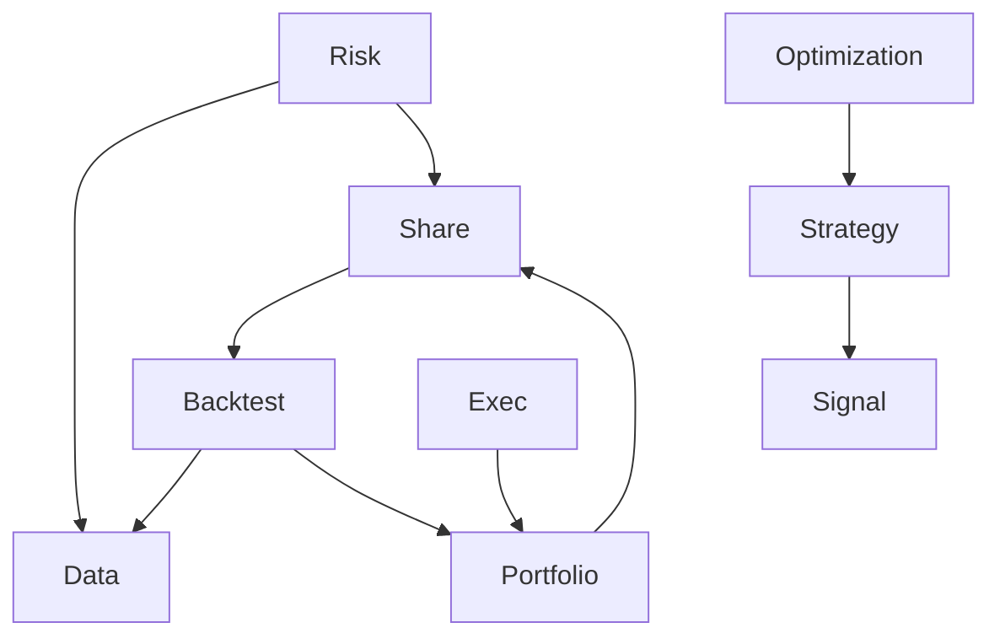

# DeepSeekQuant 架构（core_bak_refactored）

目标：明确模块边界与职责、依赖倒置策略、碎片化交付方案，并保证文档与代码一致。

模块总览
- core/signal：指标与信号生成
- core/strategy：策略编排与信号消费
- core/portfolio：组合构建与优化；提供合成组合工具
- core/backtest：事件窗口回测与报告生成（准确度指标、误差Top5）
- core/risk：压力测试、风险度量、限额管理、监控与报告（不承载backtest/data具体实现）
- core/data：历史/真实数据提供者，统一接口（Protocol）供 backtest/risk 使用
- core/exec：执行算法与订单处理
- core/optimization：参数调优（如贝叶斯）
- core/share：共享类型与小型工具（如市场配置、汇率转换）

关键原则
- 边界严格：每个模块只负责自身业务；跨模块交互通过 Protocol 接口完成。
- 碎片化交付：尚未完备的功能以“_fragments/”形式放入目标模块，待模块完善后合并。
- 依赖倒置：策略/风险等高层策略依赖接口而非具体实现，便于替换数据源与算法。
- 测试驱动：每个碎片需有对应的端到端测试，保障最小可用路径稳定。

职责与当前状态
- risk：
  - 负责场景库与压力模拟（顺序、并发、反馈回路）、风险度量、限额与监控。
  - 仅定义依赖接口（如 HistoricalDataProvider Protocol），不包含数据/回测的具体实现。
  - 已清理越界职责：删除 currency_converter.py 与 international_config.py，相关能力统一由 [core/share/exchange_rates.py](symbol:exchange_rates.py) 与 [core/share/market_config.py](symbol:market_config.py) 提供。
  - 修正不合规导入：移除对根目录 common 的尝试导入，统一使用模块内默认配置。
- backtest：
  - 事件窗口回测引擎与报告生成，摘要包含准确度与误差Top5。
  - [EventWindowBacktester](symbol:event_window_backtester.py) 与 [BacktestReporter](symbol:event_window_backtester.py) 驻留在 core/backtest/_fragments/。
- data：
  - 历史数据提供者（Mock/Real），实现 [HistoricalDataProvider](symbol:historical_data_provider.py) 接口。
  - 事件期价格生成采用确定性日漂移，严格匹配预期跌幅；成交量非负夹紧。
- portfolio：
  - 合成组合与构造器迁移至 [core/portfolio/_fragments/synthetic_portfolio.py](symbol:synthetic_portfolio.py)，供回测使用。

依赖接口
- HistoricalDataProvider（Protocol）：由 risk/backtest 消费，具体实现位于 data 模块。
- BacktestRunner（接口角色）：由 backtest 模块提供实现（EventWindowBacktester）。

碎片策略与标记
- 统一在目标模块的“_fragments/”目录落地，并在头部注释标记“来源模块与合并意图”。
- 模块完整后，合并碎片至稳定位置并移除兼容重导出。

导入与约束
- 严格限制在 core_bak_refactored/ 范围内与标准/第三方库；禁止从根 core/、infrastructure/、common.py 导入。
- 已修复：
  - [factor_model.py](symbol:factor_model.py) 移除对 common.RISK_MODEL_CONFIG 的导入，使用本模块默认参数（含 cache_ttl_seconds）。
  - [portfolio_risk.py](symbol:portfolio_risk.py) 不再尝试导入 common，统一使用本地默认 risk_model_config。

质量与一致性
- 回测集成质量：准确度（误差≤20%）阈值≥90%，并发相关性矩阵支持对称方向回退与波动率微调；实际损失计算具备NaN与价格边界检查。
- 数据生成：事件窗口价格严格匹配预期跌幅；成交量非负夹紧，确保可重复性。
- 风险模块：风险度量与限额校验保持模块职责纯净；国际化增强与市场机制检测逻辑不依赖越界配置。

演进路线
- 完成 risk/backtest/data 的接口化对接后，逐步移除 risk/backtest_framework.py 的兼容重导出，仅保留协议层。
- 引入真实数据提供者后，重新校准回测质量阈值，并扩展预测函数以纳入更多压力参数（如波动率冲击）。
- 碎片合并：在目标模块成熟后，将 _fragments 内容合并为稳定实现，并更新对应测试。

模块依赖关系架构图

